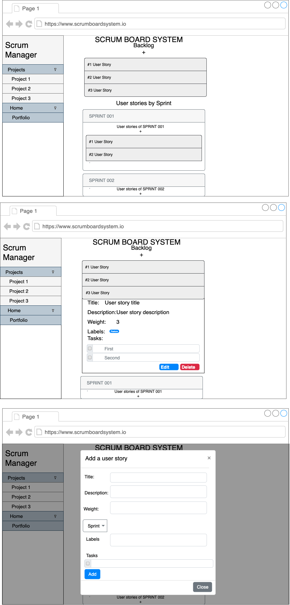

# ScrumBoardSystem-react

This project is the frontend client application for the Scrum Board System backend.
it's intented to be un reactjs using bootstrap for styling and axios as http client.

### Current State

##### User Stories

The current state of the projects enables you to list and create new user stories to the general project backlog or an specific sprint's project. It also allows you to create several tasks for the user story and mark them as done.

##### Projects

Currently allows you to list the all created projects and change between them showing all the current data for each project (sprints, user stories, tasks).

##### Sprints

Allows you to list the current created sprints for each project and also you can create user stories related to the sprints created.

### Design Proposal Wireframe

This is the design proposal for a simple SPA with all the main features, Projects, Sprints and User Stories.

### Related projects used

- [Routing](https://reactrouter.com/)
- [Bootstrap React](https://react-bootstrap.github.io/)
- [Redux](https://redux.js.org)
- [Http Proxy Middleware](https://github.com/chimurai/http-proxy-middleware)
- [Reac Hook Forms](https://react-hook-form.com/)

### Deployment to Heroku

For the deployment in Heroku it is important to consider that the app created on the platform must be created using the [Buildpack from Create-React-App](https://github.com/BrightReps/create-react-app-buildpack)
